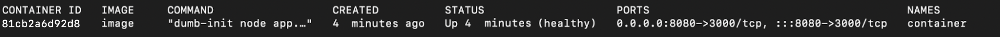
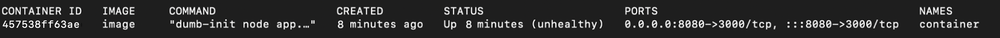

En primer lugar, creamos el Dockerfile a partir del cual crearemos la imagen, configurando los parametros necesarios para cumplir las condiciones del ejercicio en el HEALTHCHECK, utilizando la API de node.js al llevar a cabo el request.

Al iniciar la aplicacion y hacer la primera prueba de los 45 segundos, obtenemos el estado healthy.

Al realizar la segunda prueba, obtenemos el estado unhealthy

